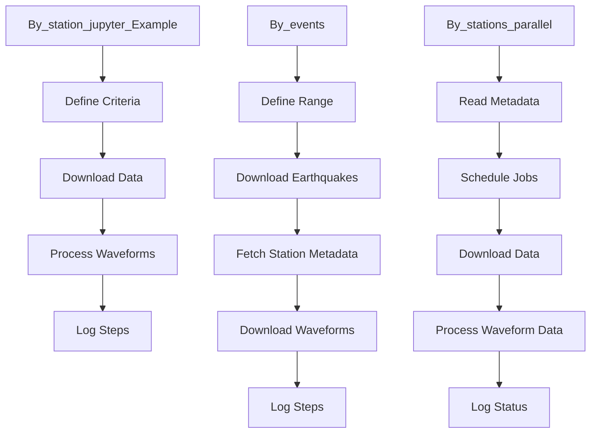

> [!WARNING]
> **AI Hallucination Disclaimer**
> This Wiki was automatically generated by Large Language Models (`DeepSeek-Coder-V2` & `Qwen2.5-72B`) to accelerate onboarding. While structurally accurate, it may occasionally hallucinate specific function calls, variable names, or execution commands (e.g., pseudo-MATLAB commands). Always cross-reference the suggested workflows with the actual source code.
> 
> *For more details on how this was generated, see [0_AI_Generation_Process](0_AI_Generation_Process.md)*

---
# Seismic Data Download System Documentation

## 1. Project Overview

The `mdl_data_dwnld` subsystem is a comprehensive suite designed to automate the downloading and processing of seismic data from the IRIS data center, catering to diverse research needs in seismology. The system is divided into three primary sub-modules:

- **By_station_jupyter_Example**: This module leverages Jupyter Notebooks and the Obspy library to download and process seismic data based on user-defined criteria such as magnitude, epicentral distance, and time windows. It includes functionalities for transforming waveforms into radial-transverse components and converting them to SAC format, with detailed logging for transparency.
- **By_events**: This module automates the downloading of earthquake data for events between 6.5 and 9.0 magnitudes from 1990 to 2025, saving it in QuakeML format using a Jupyter notebook script.
- **By_stations_parallel**: This module handles parallel downloading of seismic data for multiple stations across different networks and data centers, utilizing Bash scripting (SLURM) and Python. It reads station metadata, schedules jobs, and processes the data, including waveform transformation and filtering, with comprehensive logging at each step.

Together, these sub-modules provide a robust and flexible framework for efficient seismic data acquisition and analysis, supporting both single-station and large-scale multi-station research scenarios.

## 2. Data Architecture

```text
test_MassDownload/
└── mdl_data_dwnld/
    ├── By_events/
    │   └── 00_eq's Download Data.ipynb
    ├── By_station_jupyter_Example/
    │   └── Example_run.ipynb
    └── By_stations_parallel/
        ├── Single_Station_Data_Download_Workflow.py
        ├── dwnld_sngl_stn_slurm.sh
        └── run_me.sh
```

## 3. Code Reference

### By_station_jupyter_Example
- **`Example_run.ipynb`**:
  - **Dependencies**: Obspy, Pandas, Matplotlib
  - **Key Functions**:
    - `download_data(start_time, end_time, min_magnitude, max_distance)`: Downloads seismic data for a specified time window and magnitude range.
    - `process_waveforms(waveform_data, station_code)`: Transforms waveforms into radial-transverse components and converts them to SAC format.
    - `log_processing_steps(step, details)`: Logs the processing steps with detailed information.

### By_events
- **`*_eq's Download Data.ipynb`**:
  - **Dependencies**: Obspy, Pandas, requests
  - **Key Functions**:
    - `download_earthquakes(start_year, end_year, min_magnitude)`: Downloads earthquake data for the specified range of years and magnitudes.
    - `save_quakeml(quakes, output_file)`: Saves the downloaded earthquake metadata in QuakeML format.
    - `fetch_station_metadata(event_id)`: Fetches station metadata for a specific event.
    - `download_waveforms(event_id, stations)`: Downloads waveform data for the specified stations and event.

### By_stations_parallel
- **`dwnld_sngl_stn_slurm.sh`**:
  - **Functionality**: This script is used to submit SLURM jobs for downloading data from a single station.
  - **Usage**: `sbatch dwnld_sngl_stn_slurm.sh <station_code> <network_code>`

- **`run_me.sh`**:
  - **Functionality**: This script reads the station metadata CSV file, schedules SLURM jobs for each station, and manages the parallel download process.
  - **Usage**: `bash run_me.sh <metadata_file.csv>`

- **`Single_Station_Data_Download_Workflow.py`**:
  - **Dependencies**: Obspy, Pandas
  - **Key Functions**:
    - `read_station_metadata(metadata_file)`: Reads the station metadata from a CSV file.
    - `download_station_data(station_code, network_code)`: Downloads data for a single station.
    - `process_waveform_data(waveform_data, station_code)`: Processes the waveform data, including transformation and filtering.
    - `log_station_download(station_code, status)`: Logs the download status of each station.

## 4. Workflows

### By_station_jupyter_Example Workflow
1. **Define Criteria**: User defines the start time, end time, minimum magnitude, and maximum distance.
2. **Download Data**: The script downloads seismic data based on the defined criteria using Obspy.
3. **Process Waveforms**: Waveform data is transformed into radial-transverse components and converted to SAC format.
4. **Log Steps**: Each step of the process is logged for transparency and future reference.

### By_events Workflow
1. **Define Range**: User specifies the start year, end year, and minimum magnitude.
2. **Download Earthquakes**: The script downloads earthquake data for the specified range using Obspy and saves it in QuakeML format.
3. **Fetch Station Metadata**: For each event, station metadata is fetched from the IRIS data center.
4. **Download Waveforms**: Waveform data for the specified stations and events is downloaded.
5. **Log Steps**: Each step of the process is logged for transparency and future reference.

### By_stations_parallel Workflow
1. **Read Metadata**: The script reads the station metadata from a CSV file.
2. **Schedule Jobs**: SLURM jobs are scheduled for each station using `dwnld_sngl_stn_slurm.sh`.
3. **Download Data**: Each job downloads data for its assigned station using `Single_Station_Data_Download_Workflow.py`.
4. **Process Waveform Data**: The waveform data is processed, including transformation and filtering.
5. **Log Status**: The download status of each station is logged.

### Example Workflow Diagram



This documentation provides a comprehensive overview of the `mdl_data_dwnld` subsystem, including its data architecture, code reference, and workflows. For more detailed information, refer to the individual Jupyter Notebooks and scripts within each sub-module.
---
## 📦 Download Codebase
The complete physical codebase for this project is hosted securely on the Lab NAS.
* **NAS URL:** [https://repovibranium.synology.me:5001/](https://repovibranium.synology.me:5001/)
* **File Station Path:** `/ADAMA-Shared/GodModeData/CodeBaseFull/`
* **Search For:** `test_MassDownload_codebase_*.tar.gz`
