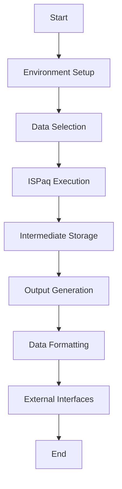

> [!WARNING]
> **AI Hallucination Disclaimer**
> This Wiki was automatically generated by Large Language Models (`DeepSeek-Coder-V2` & `Qwen2.5-72B`) to accelerate onboarding. While structurally accurate, it may occasionally hallucinate specific function calls, variable names, or execution commands (e.g., pseudo-MATLAB commands). Always cross-reference the suggested workflows with the actual source code.
> 
> *For more details on how this was generated, see [0_AI_Generation_Process](0_AI_Generation_Process.md)*

---
# Seismic Data Processing System Documentation

Welcome to the documentation for our seismic data processing system, powered by the ISPaq software suite. This guide is designed to help new team members understand the project's structure, data flow, and key components. Whether you're a developer, tester, or data analyst, this document will provide you with the necessary information to onboard smoothly.

## 1. Project Overview

### Purpose
The primary purpose of this system is to automate the setup, execution, and compilation of seismic data processing tasks using ISPaq. The goal is to handle various time ranges and dataselect operations efficiently, producing a final output file named `test.out` without user intervention.

### Key Features
- **Automation**: The system automates the entire process from environment setup to result compilation.
- **Modular Design**: Components are designed to operate independently but are tightly integrated with well-defined interfaces.
- **Data Flexibility**: Supports multiple data formats (JSON, CSV, XML) for output generation.
- **Robust Error Handling**: Ensures seamless integration with external systems and maintains reliability.

### Directory Structure
The project is organized into several directories, each serving a specific purpose:

- **test/**: Contains the main scripts and log files for testing and processing.
  - `test.sh`: Main script for initiating the data processing pipeline.
  - `.IFE..BFE.*.*.D`, `ISPAQ_TRANSCRIPT.log`, etc.: Various data files and logs generated during processing.
  - **paq_out/**: Sub-directory for ISPaq output logs.
  - **out0/**, **out/**: Directories for intermediate and final output files.
    - **IFE/**, **2017/143/**: Further subdirectories containing specific data outputs.

## 2. Data Architecture

### Data Patterns
The data architecture is designed to handle seismic data in a structured manner, ensuring that the system can process and store large volumes of data efficiently. The key data patterns are as follows:

- **Input Data**: Raw seismic data files (e.g., `.BFE`, `.IFE`) are stored in the `test/` directory.
- **Intermediate Data**: Partially processed data is stored in subdirectories like `out0/` and `paq_out/`.
- **Output Data**: Final processed data is stored in the `out/` directory, with structured formats (JSON, CSV, XML) generated by the system.

### File Structure
The file structure within each directory is designed to facilitate easy access and management of data:

- **test/**:
  - `*.BFE`, `*.IFE`: Raw seismic data files.
  - `ISPAQ_TRANSCRIPT.log`: Log file for ISPaq operations.
  - `test.sh`: Main script for initiating the process.
- **paq_out/**:
  - `ISPAQ_TRANSCRIPT.log`: Log file for ISPaq output.
- **out0/**, **out/**:
  - `.IFE..BFE.*`, `NJ.IFE..BFE.*`: Intermediate and final processed data files.

### Data Flow
The data flows through the system in a well-defined sequence:

1. **Input**: Raw seismic data is read from the `test/` directory.
2. **Processing**: The main script (`test.sh`) initiates the ISPaq software, which processes the raw data and generates intermediate results.
3. **Intermediate Storage**: Intermediate results are stored in subdirectories like `out0/` and `paq_out/`.
4. **Output Generation**: Final output is generated in various formats (JSON, CSV, XML) and stored in the `out/` directory.

## 3. Code Reference

### Main Script: `test.sh`
The `test.sh` script is the entry point for the data processing pipeline. It performs the following tasks:

- **Environment Setup**: Loads necessary modules and sets up the environment.
- **Data Selection**: Selects the appropriate time ranges and dataselect operations.
- **ISPaq Execution**: Initiates ISPaq to process the selected data.
- **Output Generation**: Generates structured output files in various formats.

#### Example Usage
```sh
# Navigate to the test directory
cd test/

# Run the main script
./test.sh
```

### Output Generators
The `out/` sub-module contains scripts that generate structured data based on the upstream results. These generators are responsible for converting raw output into usable formats.

- **JSON Generator**: Converts data into JSON format.
- **CSV Generator**: Converts data into CSV format.
- **XML Generator**: Converts data into XML format.

#### Example Script: `json_generator.sh`
```sh
#!/bin/bash

# Read the intermediate data file
input_file="out0/IFE/IFE...BFE.*.*"

# Generate JSON output
output_file="out/IFE...BFE.json"
python3 json_converter.py $input_file > $output_file

# Log the operation
echo "Generated JSON output: $output_file" >> ISPAQ_TRANSCRIPT.log
```

### Data Formatters
Data formatters are responsible for ensuring that the generated data is in the correct format and structure. They handle tasks such as validation, normalization, and formatting.

#### Example Script: `data_formatter.py`
```python
import json

def format_data(input_file, output_file):
    with open(input_file, 'r') as f:
        data = json.load(f)
    
    # Perform data formatting (e.g., normalization, validation)
    formatted_data = {
        "timestamp": data["timestamp"],
        "magnitude": data["magnitude"],
        "location": data["location"]
    }
    
    with open(output_file, 'w') as f:
        json.dump(formatted_data, f, indent=4)

if __name__ == "__main__":
    input_file = "out/IFE...BFE.json"
    output_file = "out/formatted_IFE...BFE.json"
    format_data(input_file, output_file)
```

### External Interfaces
External interfaces are responsible for delivering the formatted outputs to their destinations. This can include databases, APIs, and user interfaces.

#### Example Script: `database_loader.py`
```python
import sqlite3

def load_to_database(output_file):
    conn = sqlite3.connect('seismic_data.db')
    cursor = conn.cursor()
    
    with open(output_file, 'r') as f:
        data = json.load(f)
    
    # Insert data into the database
    cursor.execute("INSERT INTO seismic_data (timestamp, magnitude, location) VALUES (?, ?, ?)",
                   (data["timestamp"], data["magnitude"], data["location"]))
    
    conn.commit()
    conn.close()

if __name__ == "__main__":
    output_file = "out/formatted_IFE...BFE.json"
    load_to_database(output_file)
```

## 4. Workflows

### Data Processing Workflow
The data processing workflow is a step-by-step process that ensures the system operates efficiently and reliably. The following diagram illustrates the key steps:



#### Step-by-Step Workflow
1. **Start**: The process begins with the execution of `test.sh`.
2. **Environment Setup**: Necessary modules and environment variables are loaded.
3. **Data Selection**: Time ranges and dataselect operations are specified.
4. **ISPaq Execution**: ISPaq processes the selected data, generating intermediate results.
5. **Intermediate Storage**: Intermediate results are stored in `out0/` and `paq_out/`.
6. **Output Generation**: Output generators convert intermediate results into structured formats (JSON, CSV, XML).
7. **Data Formatting**: Data formatters ensure the output is correctly formatted and validated.
8. **External Interfaces**: Formatted data is delivered to external systems (databases, APIs, user interfaces).
9. **End**: The process concludes with a final log entry.

### Example Workflow
1. **Start**: Run `test.sh` from the command line.
2. **Environment Setup**: Ensure necessary modules are loaded and environment variables are set.
3. **Data Selection**: Specify the time range and dataselect operations in `test.sh`.
4. **ISPaq Execution**: ISPaq processes the data, generating intermediate logs in `paq_out/` and intermediate results in `out0/`.
5. **Output Generation**: Run output generators (e.g., `json_generator.sh`) to convert intermediate results into JSON format.
6. **Data Formatting**: Use `data_formatter.py` to ensure the JSON data is correctly formatted.
7. **External Interfaces**: Load the formatted data into a database using `database_loader.py`.
8. **End**: Verify the final output and log the completion of the process.

By following this comprehensive guide, new team members should be able to understand the project's structure, data flow, and key components, enabling them to contribute effectively to the seismic data processing system.
---
## 📦 Download Codebase
The complete physical codebase for this project is hosted securely on the Lab NAS.
* **NAS URL:** [https://repovibranium.synology.me:5001/](https://repovibranium.synology.me:5001/)
* **File Station Path:** `/ADAMA-Shared/GodModeData/CodeBaseFull/`
* **Search For:** `test_ispaq_codebase_*.tar.gz`
